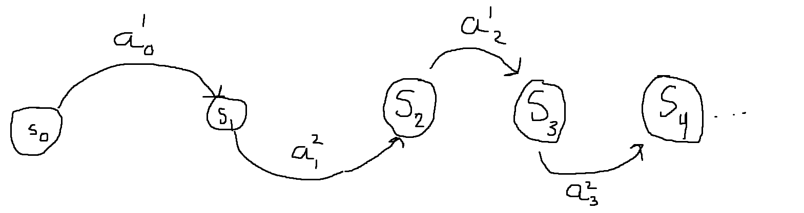
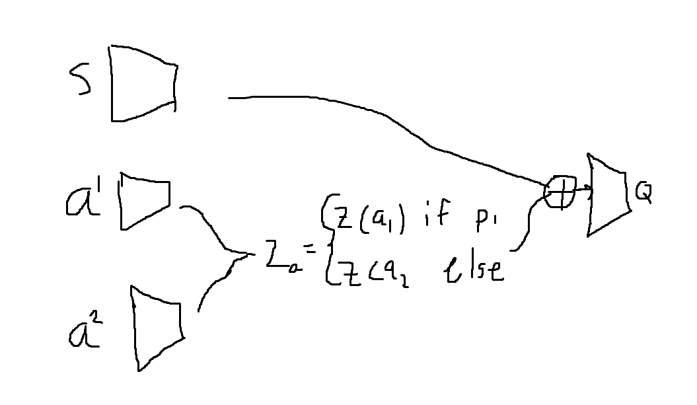

# qtttgym

AI Gymnasium like environment for QTTT.

Derived from the quantum tic-tac-toe game described in [this paper](http://urn.kb.se/resolve?urn=urn:nbn:se:kth:diva-320190).

## Theory

We should draw inspiration from [AlphaGo](https://discovery.ucl.ac.uk/id/eprint/10045895/1/agz_unformatted_nature.pdf), AlphaGo only utilizes self-play and doesn't do any pretraining on human data, unlike it's predecessor AlphaZero.

From what I gather, the idea is not to learn a single policy $\pi_\theta(a|s)$ and a single value function $V_\theta(s)$ just as in normal actor critic. AlphaGo uses a two-headed neural network which maps the state vector $s$ to both the value $V_\theta(s)$ and the action probabilities $\pi_\theta(a|s)$. The state vector $s$ includes only the board state, and is in the perspective of the player that is about to make a move.

The main algorithm is Monte Carlo Tree Search(MCTS), this is an algorithm that I've never implemented and can potentially be a head ache. The search tree consists of nodes $s$ and edges $(s,a)$ for all legal actions $a\in\mathcal{A}(s)$. Each edge in this tree stores the following statistic

$$\{N(s,a), W(s,a), Q(s,a), P(s,a)\}$$

where $N(s,a)$ is the visit count, $W(s,a)$ is the total action-value, $Q(s,a)$ is the mean action-value and $P(s,a)$ is the prior probability of selecting that edge. MCTS from my understanding seems to be a iteration of 3 phases, Select, Expand/Evaluate and Backup.

### Select

at any one timestep $t$, the action is taken according to $\arg\max_a Q(s,a)  + U(s,a)$

$$U(s,a) = c_{puct}P(s,a)\frac{\sqrt{\sum_b N(s,b)}}{1 + N(s,a)}$$

where $c_{puct}$ is a constant determining the level of exploration the paper doesn't mention what values this constant should take. Regradless of what $c_{puct}$ is we can see that this exploration scheme will favor high prior and low visit counts, but asymptotically prefers actions with large $Q(s,a)$ as $N \rightarrow\infty$.

### Expand and Evaluate

The DFS will stop when we hit a leaf node $s_L$ or we reach a depth limit. In the AlphaGo paper they talk about adding the rotations and reflections of the root node in order to learn the rotational and reflectional invariances of winning states. We don't need to do this since the state space is not "that" large

### Backup

The edge statistics are updated in a backward pass through each step t ≤ L. The visit counts are incremented, $N(s_t, a_t) = N(s_t, a_t)+1$, and the action-value is updated to the mean value, $W(s_t, a_t) = W(s_t, a_t) + v$, $Q(s_t, a_t) = W(s_t,a_t)/N(s_t,a_t)$. The AlphaGo paper writes "We use virtual loss to ensure each thread evaluates different nodes", which I don't quite understand so we need to look this up

### Play

After the MCTS we select the action at the root node $s_0$ according to:

$$\pi(a|s_0) = \frac{N(s_0, a)^{1/\tau}}{\sum_b N(s_0, b)^{1/\tau}}$$

where $\tau$ is a temperature which controls the level of exploration. The MCTS tree is then pruned when an action $a$ is taken while the subtree of the resulting node is used as the root node. AlphaGo also resigns if the value of the root node is less than a threshold value $v_{resign}$.

### Code

I found one implementation of MCTS [here](https://github.com/JoshVarty/AlphaZeroSimple/blob/b68171a5cb9367b407017e07f5de3f65b10e888e/monte_carlo_tree_search.py#L97). We can use this just to get an idea of how the algorithm will look like

From reading the AlphaGo paper, I get the impression that the core algorithmic breakthrough is the multiheaded neural network, MCTS and count based exploration

## Action space and NN architecture

So an agent has a total of $9^2=81$ different actions. This on the limit of what is doable with traditional DQN. We might need to use an policy gradient approach to this problem where use make create an autoregressive policy. Since our policy has to generate two integers $x$ and $y$ we can utilize the factorization of distributions.

$$
\pi_\theta(x,y|s) = \pi_\theta(x|y,s)\pi_\theta(y|s)
$$

This way we only need to design a NN with 18 output nodes, which is significantly easier to train.

Since our environment is relatively small and easy to sample from, we should be able to simply run PPO on this problem and hopefully it should converge to a good policy. The potential downside I see with this is that if we train an agent with self play, we might run into situation where our AI might not be able to know how to play against any other opponent that itself. So if we were to do a Q learning approach(like SAC) we might be more flexible in situations where the AI is not playing against itself. In this case I think we can be really sneaky and implement a really clever Q function NN that might be easier to train.

In short, the action encoding will since we shouldn't care about the action of player 2 on player 1s turn, we should completly remove the latent encoding of that action as we propogate our latent vector foward through our NN.

These are all of my current thoughts on this problem
